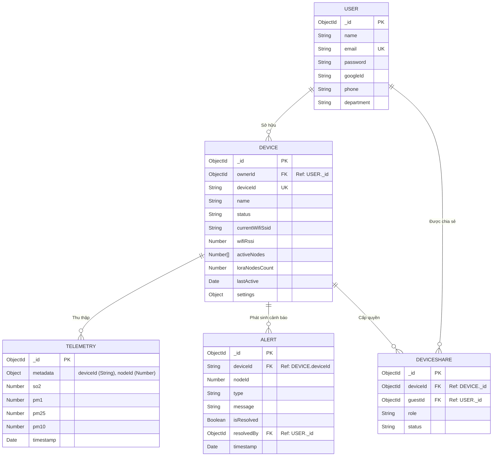

# Thiết Kế Cơ Sở Dữ Liệu (Database Schema) - SCADA IoT

Tài liệu này mô tả cấu trúc dữ liệu mới nhất, được tối ưu hóa bằng MongoDB Time-Series và các kỹ thuật đánh Index để xử lý dữ liệu lớn (Big Data) từ các trạm IoT Gateway.

## 1. Sơ Đồ Thực Thể Liên Kết (ERD)

## 2. Chi Tiết Các Bảng (Collections)

### Collection: `users`
| Tên trường (Field) | Kiểu dữ liệu (Type) | Bắt buộc | Mặc định | Mô tả & Ràng buộc |
|:---|:---|:---:|:---:|:---|
| `_id` | ObjectId | Có | Tự sinh | Khóa chính tự sinh bởi MongoDB |
| `name` | String | Có | - | Tên người dùng |
| `email` | String | Có | - | Email tài khoản, đánh **Unique Index** |
| `password` | String | Không | - | Mật khẩu mã hoá Bcrypt |
| `googleId` | String | Không | null | Khóa liên kết OAuth Google |
| `phone` | String | Không | "" | Số điện thoại |
| `department` | String | Không | "" | Phòng ban quản lý |

---

### Collection: `devices`
Bảng quản lý Trạm Thu (Gateway) và các cảm biến LoRa trực thuộc.
| Tên trường (Field) | Kiểu dữ liệu | Mặc định | Mô tả & Ràng buộc |
|:---|:---|:---:|:---|
| `deviceId` | String | - | Mã định danh phần cứng (Ví dụ: `001`). Cấu hình **Unique** |
| `ownerId` | ObjectId | - | Khóa ngoại chỉ định chủ sở hữu hợp pháp |
| `status` | String | 'offline' | Trạng thái Heartbeat nhịp sống MQTT mới nhất |
| `activeNodes` | Array[Number] | [] | Mảng chứa danh sách các Node ID LoRa đang gửi dữ liệu về Trạm này |
| `loraNodesCount`| Number | 0 | Số lượng cảm biến LoRa (tự động đếm dựa trên `activeNodes`) |
| `lastActive` | Date | Date.now | Cột mốc thời gian chốt điểm danh (Heartbeat) bản tin MQTT gần nhất |
| `settings` | Object | - | Lưu cấu hình ngưỡng `thresholds` (limit_so2, limit_pm) và cấu hình OTA (hostname, password) |

---

### Collection: `telemetries` (Bảng Lịch sử Timeseries)
Sử dụng **Mongoose Native Time-Series** chuyên dụng cho dữ liệu IoT. Tốc độ đọc/ghi biểu đồ siêu tốc.
| Tên trường (Field) | Kiểu dữ liệu | Mô tả |
|:---|:---|:---|
| `metadata` | Object | Trường meta bắt buộc cho Time-Series. Chứa `{ deviceId: String, nodeId: Number }` |
| `so2` | Number | Nồng độ khí độc SO2 (ppm) |
| `pm1` | Number | Nồng độ bụi mịn PM1.0 (µg/m³) |
| `pm25` | Number | Nồng độ bụi mịn PM2.5 (µg/m³) |
| `pm10` | Number | Nồng độ bụi mịn PM10 (µg/m³) |
| `timestamp` | Date | Đồng bộ chính xác với thời gian vi điều khiển (hoặc server fallback) |

---

### Collection: `alerts`
Lưu trữ nhật ký cảnh báo khi nồng độ chất lượng không khí vượt ngưỡng hoặc khi thiết bị ngắt kết nối.
| Tên trường (Field) | Kiểu dữ liệu | Mô tả |
|:---|:---|:---|
| `deviceId` | String | Mã định danh Gateway |
| `nodeId` | Number | Mã định danh Node LoRa gây ra cảnh báo |
| `type` | Enum | `'threshold_breach'` (Vượt ngưỡng) hoặc `'device_offline'` (Mất kết nối) |
| `message` | String | Nội dung cảnh báo chi tiết |
| `isResolved` | Boolean | Đánh dấu trạng thái nhân viên đã xử lý (Mặc định: `false`) |
| `resolvedBy` | ObjectId | Khóa ngoại trỏ về nhân viên (`User._id`) đã bấm xác nhận xử lý xong |

---

### Collection: `deviceshares`
Bảng trung gian để cấp quyền truy cập thiết bị (Share Device).
| Tên trường (Field) | Kiểu dữ liệu | Mô tả |
|:---|:---|:---|
| `deviceId` | ObjectId | Khóa ngoại trỏ đến Thiết bị được chia sẻ |
| `guestId` | ObjectId | Khóa ngoại trỏ đến Người dùng được mời xem |
| `role` | Enum | `'viewer'`, `'editor'`, hoặc `'admin'` |
| `status` | Enum | Trạng thái lời mời: `'pending'`, `'accepted'`, `'rejected'` |

---

## 3. Chỉ mục Tối Ưu (Indexes) Hệ Thống
1. **`users.email_1`**: `Unique Index` - Ngăn chặn trùng email đăng ký.
2. **`devices.deviceId_1`**: `Unique Index` - Bảo đảm mỗi phần cứng là duy nhất.
3. **`alerts.deviceId_1_isResolved_1`**: `Compound Index` - Giúp tăng tốc độ truy vấn đếm (`countDocuments`) các lỗi cảnh báo chưa được xử lý để hiện lên chuông thông báo (Notification) trên Dashboard.
4. Bảng `telemetries` tự động sử dụng Engine cấp thấp của MongoDB Timeseries để tổ chức index theo `timestamp` và `metadata`, tối ưu tuyệt đối cho vẽ Chart.js.
